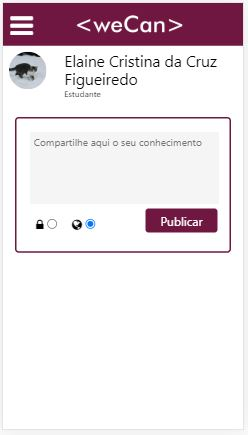

# Rede Social - We Can

* [1. Introdução](#1-introdução)
* [2. Definição do Produto](#2-definição-do-produto)
* [3. Resumo do Projeto](#3-resumo-do-projeto)
* [4. Ferramentas Utilizadas](#4-ferramentas-utilizadas)
* [5. Protótipo](#5-protótipo)
* [6. Desenvolvedoras](#6-desenvolvedoras)

## 1. Introdução
Muitas vezes as novas desenvolvedoras se vêem perdidas no meio de um mar de conteúdo e acabam não encontrando o material ideal para o que buscam no momento, então, através desta rede elas poderão se comunicar, conhecer novas pessoas e contar com o apoio de muitas mulheres que tem o mesmo objetivo, crescer na área e desenvolver habilidades técnicas.
A rede social **We Can** surge para facilitar e apoiar novas desenvolvedoras Front-end, oferecendo troca de material de apoio para estudos.
Porque juntas **We Can**!!!

## 2. Definição do Produto

Após identificarmos os problemas com os quais nós, alunas da _Laboratória_ nos deparávamos diariamente, decidimos que uma rede social de apoio para estudos seria fundamental para o desenvolvimento das nossas colegas programadoras, pois facilitaria e otimizaria o tempo gasto com busca de material técnico.

## 3. Resumo do Projeto

- O site foi desenvolvido para versão **mobile-first**.
- É uma Single Page Application (SPA), o sistema de troca de telas é feito de maneira dinâmica sem recarregamento de página.
- O site é responsivo.
- Temos uma página para logar com e-mail e senha ou com a conta Google.
- Uma tela para cadastro para novas usuárias.
- Um Feed para compartilhar conhecimento através de posts, interação via comentários e curtidas. É possível deixar as postagens públicas ou privadas e deletar publicações.
- Uma página de perfil para atualizar e modificar informações pessoais.
- Todo o planejamento foi baseado em **Histórias de Usuário** pré-definidas junto a apresentação do projeto _Social-NetWork_.

## 4. Ferramentas utilizadas

+ Firebase & Firestore
+ Vanilla JS
+ HTML 5
+ CSS
+ Git e GitHub
+ Visual Studio Code

## 5. Protótipo

* Mobile-First - Tela de Login e Feed
 
 

## 6. Desevolvedoras
* Elaine Figueiredo
* Gisele Cesar
* Jessica Brunhara